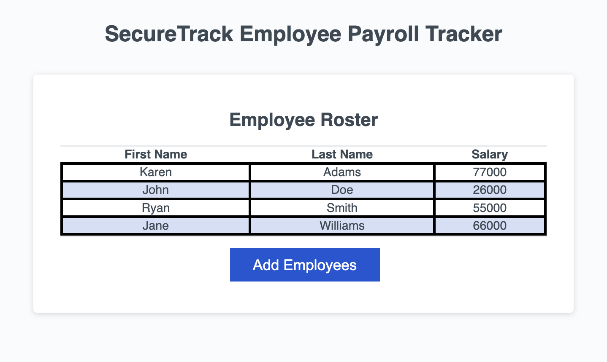

<h1> SecureTrack </h1>
<h3> SecureTrack allows companies to log and sort salaries for their employees using JavaScript. Additonally, it can randomly choose an employee and display their data and it calculates the average salary of all employees for the whole company. At the company's discretion, more features can be added. Try our tool today and enter arbitrary data of your choosing.  
</h3>

<h4> Visit us at <a href="https://scurvyirv.github.io/securetrack/">SecureTrack</a> to track your company's salary data! </h4>

